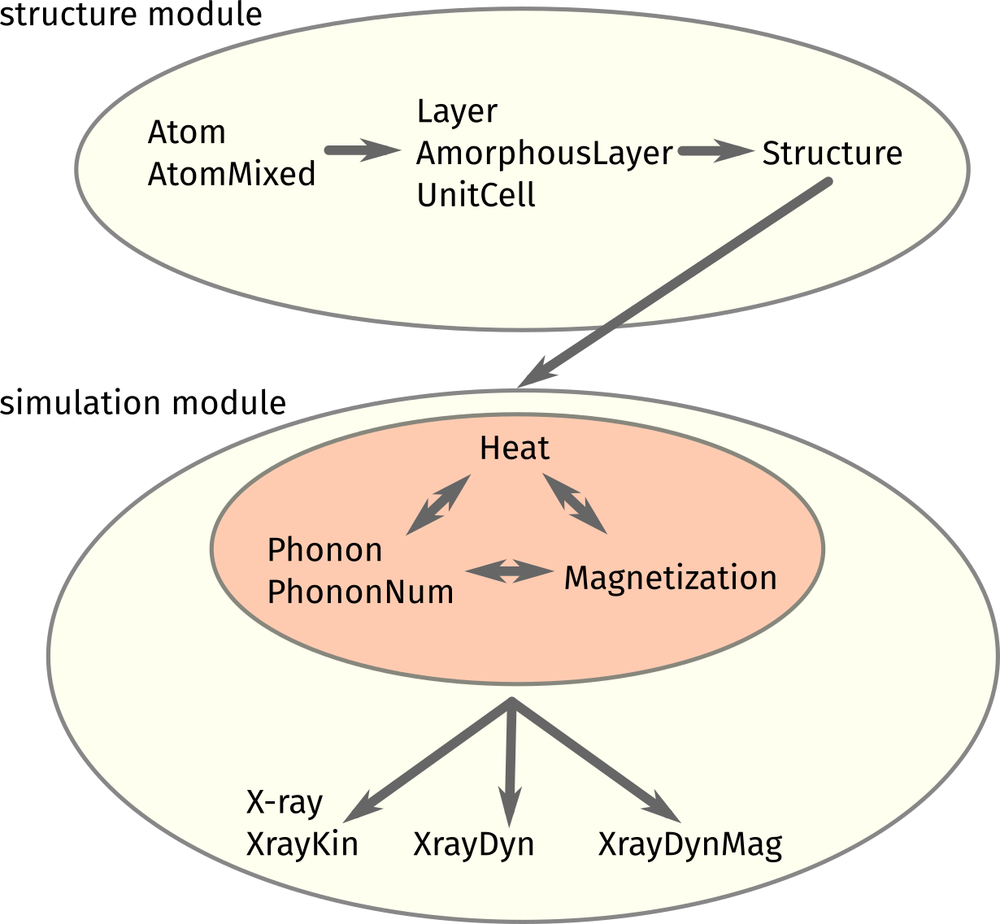

User Guide
==========

The udkm1Dsim toolbox comes as a Python package which can be easily installed
with all of its dependencies.

In case you encounter any issues during the installation or usage of the
package, please open an 
`issue at GitHub <https://github.com/dschick/udkm1Dsim/issues>`_.

The internal structure of the udkm1Dsim toolbox is sketched in the lower figure:

To get started, please work yourself through the `Examples <examples.html>`_.

For more detailed information, also regarding the physics, you might refer to
the `API Documentation <api.html>`_.