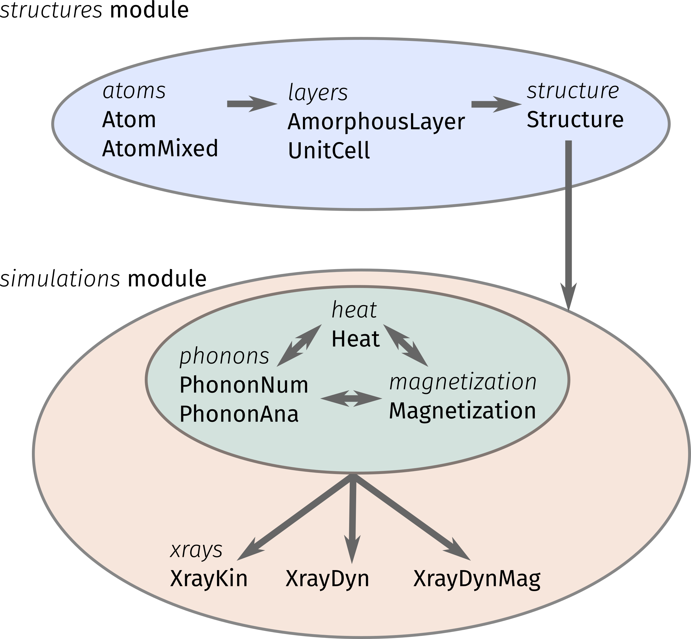
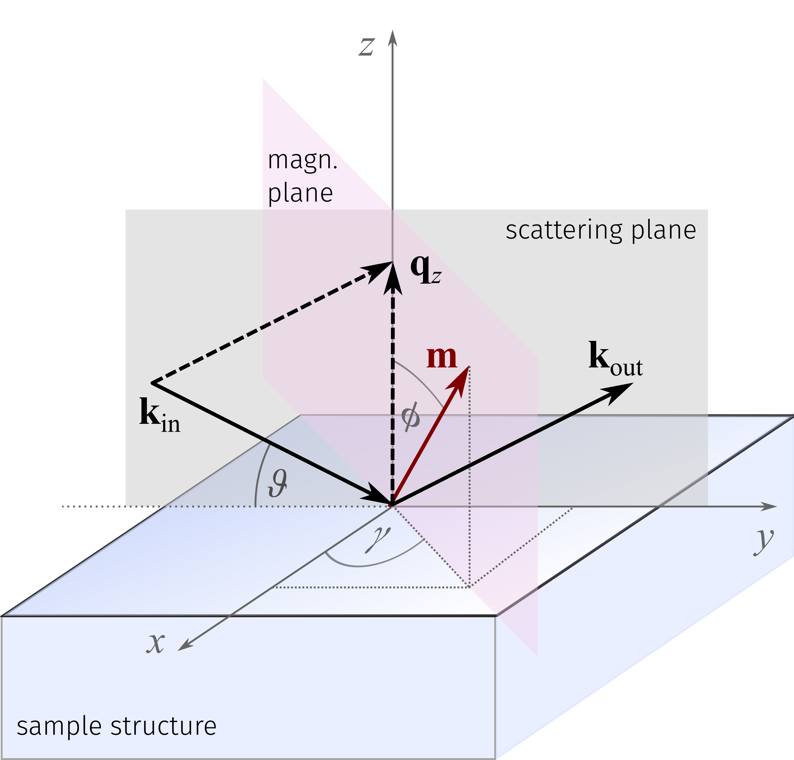

User Guide
==========

The *udkm1Dsim* toolbox comes as a Python package which can be easily installed
with all of its dependencies.

In case you encounter any issues during the installation or usage of the
package, please open an 
`issue at GitHub <https://github.com/dschick/udkm1Dsim/issues>`_.

The internal structure of the *udkm1Dsim* toolbox is sketched in the lower figure:

The common experimental scheme is sketched below and shows the general
definition of coordinates and angles that are used throughout the *udkm1Dsim*
toolbox.
The incoming and outgoing wavevectors :math:`\vec{k}_\text{in}` and
:math:`\vec{k}_\text{out}` define the scattering plane which must be co-planar
to the sample surface, hence only accessing scattering vectors :math:`\vec{q_z}`
along the surface normal.
The pointing of the magnetization vector :math:`\vec{m}` is defined by the two
angles :math:`\phi` and :math:`\gamma` and allows any direction in the
:math:`xyz` coordinate system.
The sample structure is defined from top to bottom. Accordingly the distances
with in the sample structure start at its surface and proceed along
:math:`-z` direction.

To get started, please work yourself through the `Examples <examples.html>`_.

For more detailed information, also regarding the physics, you might refer to
the `API Documentation <api.html>`_.